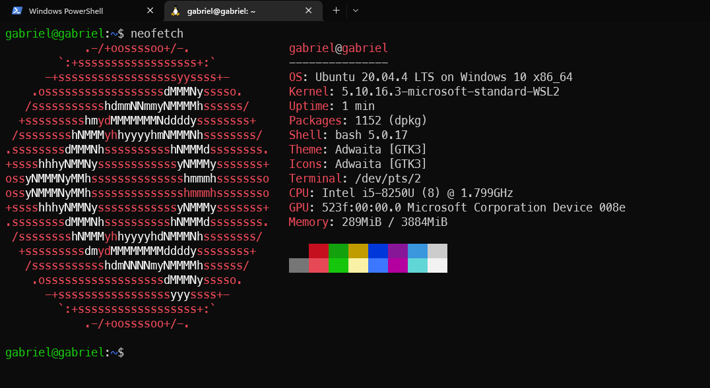

# OS_WSL2-Kernel
Mudança do kernel do WSL afim de  adicionar uma chamada de sistema Hello World

Para realizar esse trabalho prático utilizou-se o WSL2 na distribuição Ubuntu 20.04 que tem o kernel base 5.10.16.3-microsoft-standard-WSL2. Para saber o kernel basta digitar:

`$uname -r`

ou 

`$neofetch`



# 1. Download do arquivos do kernel

---

Para realizar essa etapa é necessário utilizar o Git e clonar o repositório da Microsoft, WSL2-Linux-Kernel:

`$sudo apt install git`

`$mkdir kernel`

`$cd kernel`

`$git clone https://github.com/microsoft/WSL2-Linux-Kernel.git`

A pasta kernel pode ser criada em qualquer lugar já que compilaremos em cima dela e o executável será movido para a pasta raiz do Windows e lá faremos alterações com auxílio do PowerShell.

# 2. Criação da chamada

No diretório WSL2-Linux-Kernel, gerado pelo clone da etapa passada, crie um diretório hello e dentro desse um arquivo hello.c. 

`$mkdir hello`

`$cd hello`

Para manipular o arquivo hello.c utilizaremos qualquer editor de texto e pelo terminal é mais fácil utilizar o nano, pico, vim ou o lunar vim, nesse caso utilizaremos o nano:

`$nano hello.c`

copiando o seguinte código:

````
#include <linux/kernel.h>
#include <linux/syscalls.h>

SYSCALL_DEFINE0(hello)

{
    printk("Hello World.\n");
    return 0;
}
````

Esse código contem o printk que é uma função C da interface do kernel Linux que imprime mensagens no log do kernel. Então, ao final do processo, ao ver as mensagens do buffer do kernel, quando o código for compilado e executado, Hello World deverá aparecer. O SYSCALL_DEFINE0 irá definir a chamada de sistema para o hello que estamos criando.

Como o kernel do linux tem vários Makefiles devemos avisar qual é o arquivo de origem ao arquivo objeto gerado e para isso criamos um Makefile `$touch Makefile` e colocamos o seguinte código:

````
obj-y := hello.o
````

Nisso voltamos uma pasta `$ cd ..` para manipular o Makefile principal e ao editar como `$nano Makefile` procuraremos a segunda aparição do core-y nesse arquivo. Ele estará com os seguintes módulos:

````
kernel/ certs/ mm/ fs/ ipc/ security/ crypto/ block/
````

e o objetivo é adicionar o hello após o block

````
kernel/ certs/ mm/ fs/ ipc/ security/ crypto/ block/ hello/
````

Antes de compilarmos e instalarmos devemos adicionar a nova chamada na biblioteca de syscalls do linux, portanto:

`$nano include/linux/syscalls.h`

e chegando no #endif, presente na última linha do arquivo, acima dele adicionaremos:

````
asmlinkage long sys_hello(void);
````

Por fim, adicionamos a chamada na tabela de chamadas de sistema, e para isso:

`$nano arch/x86/entry/syscalls/syscall_64.tbl`

e na última chamada adicionamos o nosso hello, é provável que tenha 547 chamadas no kernel, portanto:

````
548     common  hello                sys_hello
````

# 3. Compilação
---

Para essa etapa precisamos instalar:

`$ sudo apt install build-essential flex bison dwarves libssl-dev libelf-dev`

Terminada a instalação, para compilarmos, o seguinte código se faz necessário:

`$ make KCONFIG_CONFIG=Microsoft/config-wsl`

O código acima pode ser modificado de acordo com a quantidade de processadores, para saber basta abrir o gerenciador de tarefas na aba desempenho. Para o meu caso, utilizarei 4 dos 8 processadores, portanto:

`$ make KCONFIG_CONFIG=Microsoft/config-wsl -j4`

O processo dura entorno de 10 a 30 minutos.

# 4. Configuração
---

Após a compilação um arquivo chamado vmlinux será gerado, esse é o nosso novo kernel e para isso copiamos ele para a pasta do usuário do windows pois lá criaremos um arquivo do wsl para configuração, para isso:

`$ sudo cp vmlinux /mnt/c/Users/<Nome_Usuário>/`

Abrindo o PowerShell, criaremos o arquivo .wslconfig:

`code .wslconfig` 

e adicionaremos:

````
[wsl2]
kernel=C:\\Users\\<Nome_Usuário>\\vmlinux
````
Note que code só poderá ser chamado se o vscode estiver instalado, caso não o tenha, baixe ou utilize o notepad do Windows.

Por padrão, o wsl sempre apontará para a variável kernel, e nesse caso estamos apenas alterando seu valor com um caminho diferente do padrão. Agora o kernel é o vmlinux e ainda no PowerShell digitaremos:

`wsl --shutdown <Nome_Distribuição>`

Abrindo novamente a distribuição no wsl, e realizando o `$uname -r` percebemos que o kernel foi alterado.

# 5. Teste

Criando um novo arquivo, `$ nano teste.c`, colocaremos este código:

````
#include <stdio.h>
#include <linux/kernel.h>
#include <sys/syscall.h>
#include <unistd.h>
int main()
{
         long int amma = syscall(548);
         printf("System call sys_hello returned %ld\n", amma);
         return 0;
}
````

Realizando a compilação e a execução: 
````
gcc teste.c
./a.out
````

obtemos a mensagem System call sys_hello returned 0 e analisando o `$ dmsg` a última linha mostra um Hello World.
